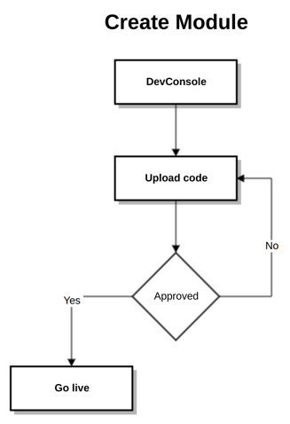
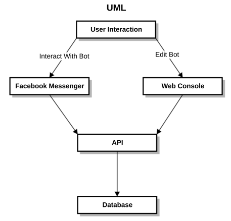
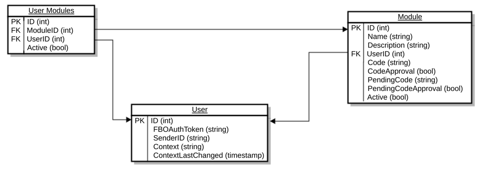
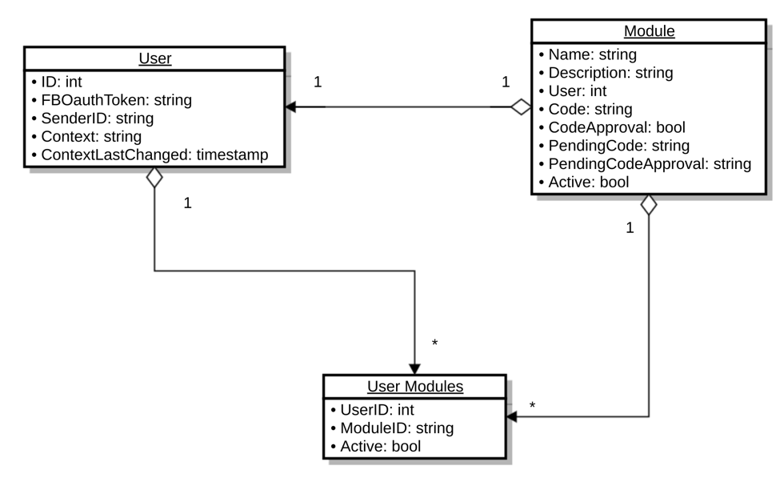
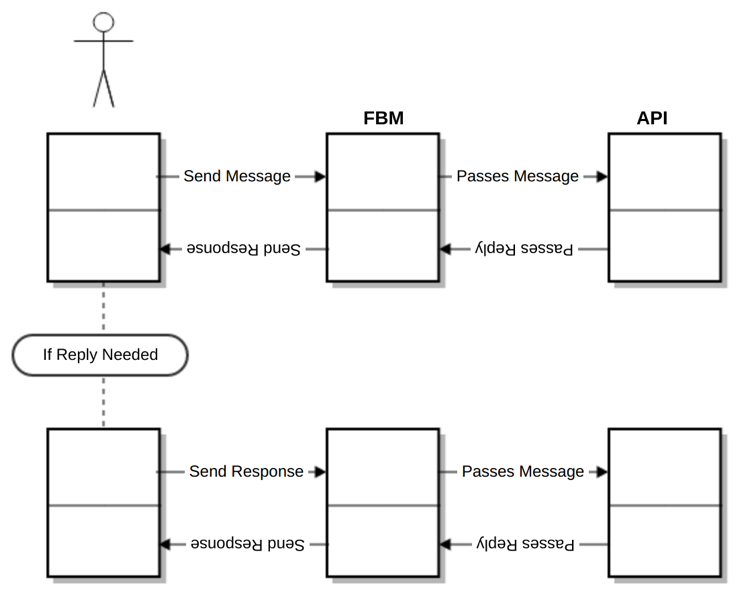
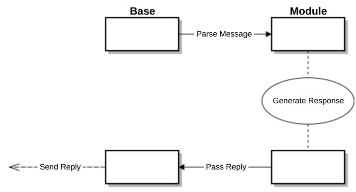
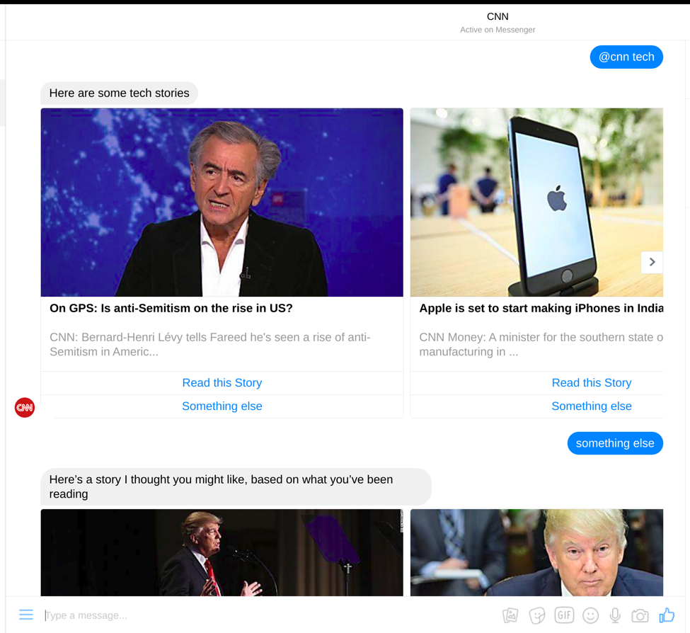
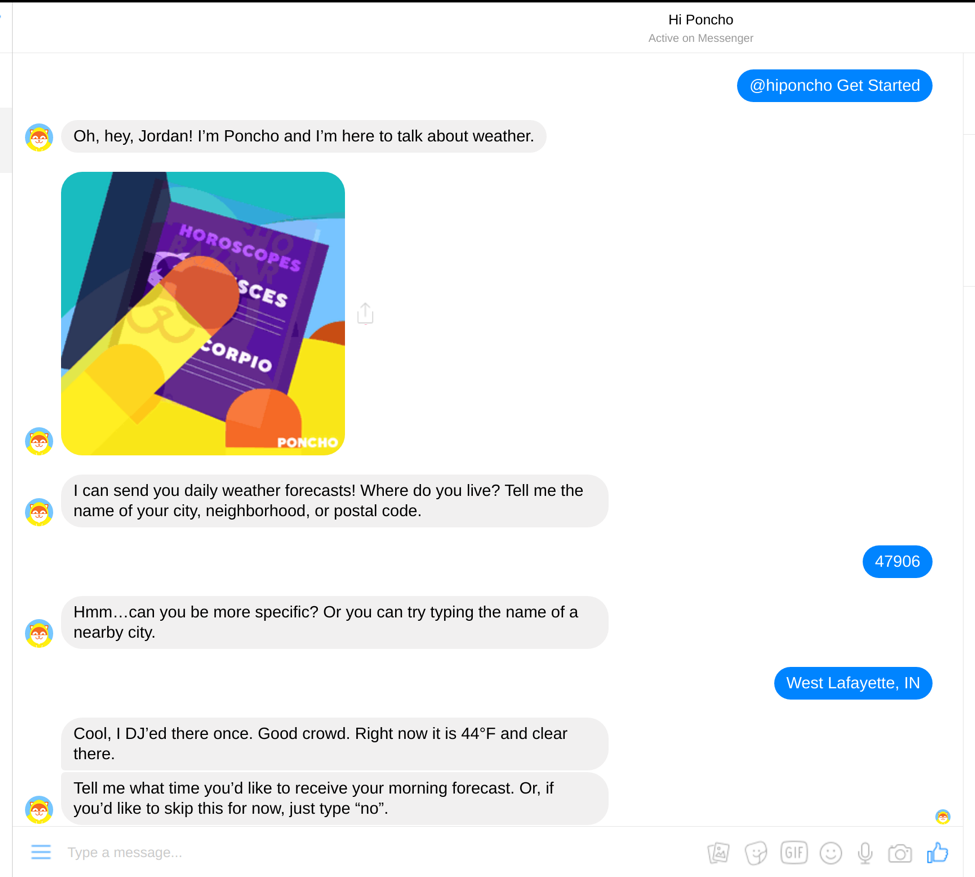
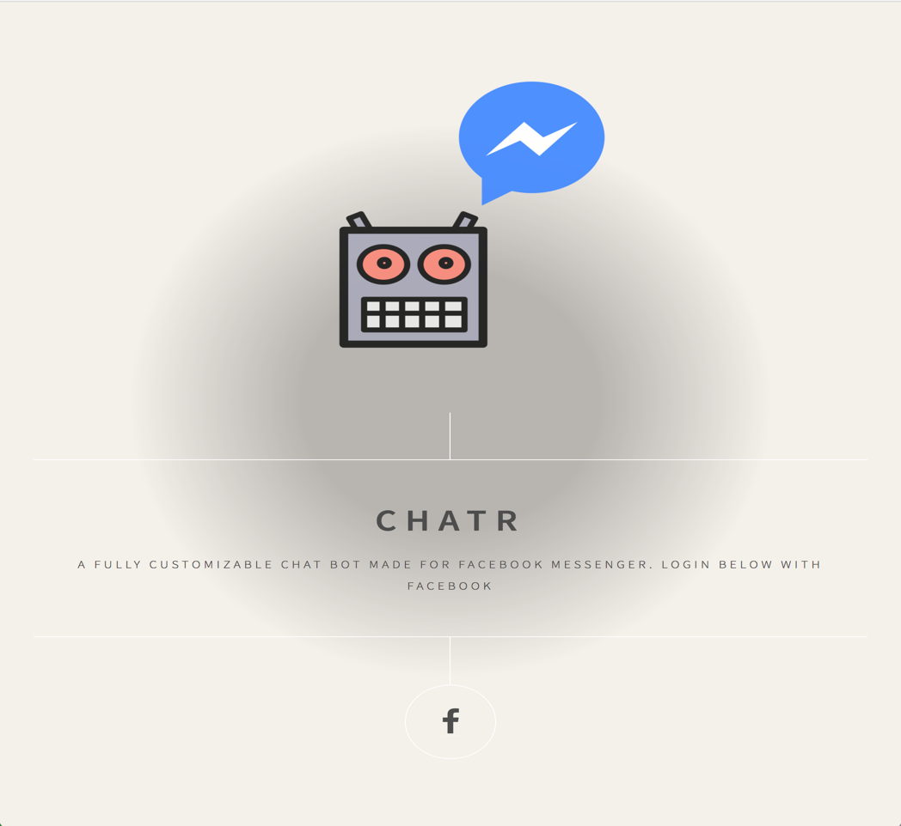
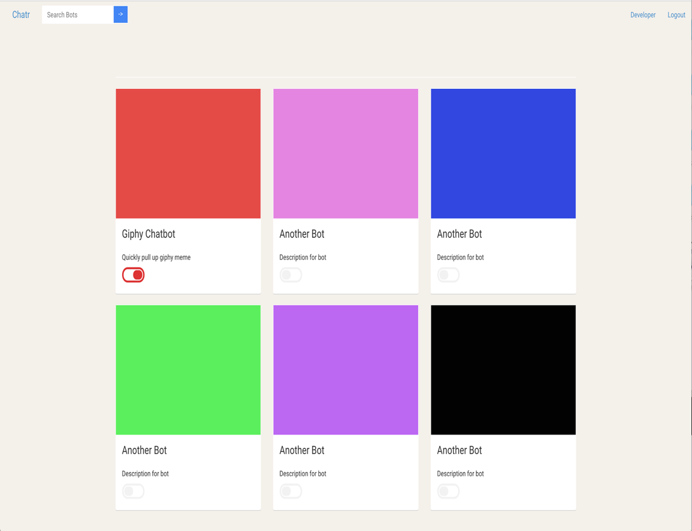

# Chatr - Design Document

Team 5: Michael Bilstein (@Meegul), Kevin Dong (@kevindong), Scott Mangiapane (@scottmangiapane), Jay Patel (@patel445), and Jordan Pitlor (@piticent123).

*Note: This document is not the controlling version of the design document. The submitted PDF is.*
## Purpose
### Description
Today, creating a chatbot is easier than ever for developers. There are open APIs for both chat services and bots themselves. However, the acronym API doesn’t mean anything to the average person. At the same time, this doesn’t mean that they have no interest in creating and using their own chatbot. This is where Chatr comes in.

At its most basic level, Chatr is meant to give the layperson the ability to create their own chatbot, with as little technical knowledge required as possible. Users will be able to create a chatbot from a website, selecting the functionality that they want their bot to have. On the website used to create/manage these bots, users will be able to search for different ‘modules’, as well as select from a list of recommended modules.

‘Modules’ represent all of the bot functionality of Chatr. A bot with no modules wouldn’t respond to any messages. When a user wishes to talk to a bot, they will directly address it by using its name along with an ‘@’ sign. For example, if there existed a ‘Google’ module that made Google searches, the user would make a search by sending a message similar to the following: “@Google cat pictures.” The appropriate module will then receive this text as an input and generate the response if necessary.

Modules will come from an open developer marketplace, where any developer can upload their own module to be approved and added to the repository of modules users can select.

### Functional Requirements
1. As a user, I would like to register using Facebook authentication.
2. As a user, I would like to log in via Facebook authentication. 
3. As a user, I would like to logout of my account.
4. As a user, I would like to delete my account.
5. As a user, I would like to have a single marketplace to see all available modules.
6. (If time allows) As a user, I would like to have multiple platforms on which I can deploy my bot.
7. As a user, I would like to add modules to my bot at any time.
8. As a user, I would like to remove modules from my bot at any time.
9. As a user, I would like to be able to search for modules.
10. As a user, I would like to switch bot configurations at any time.
11. As a user, I would like to enable / disable a bot on specific chats.
12. As a user, I would like to send bug reports to developers if my selected modules aren’t working as I expect.
13. As a developer, I would like to upload my own module(s).
14. As a developer, I would like users to use my uploaded module(s).
15. As a developer, I would like to publish my module(s) to a public database.
16. As a developer, I would like to see how many users are using my module(s).
17. As a developer, I would like to remove my module(s) at any time.
18. As a developer, I would like to update my module(s) at any time.
19. As a developer, I would like to automatically be sent error logs when they occur.
20. (If time allows) As a developer, I would like to send push notifications to the users of my module(s).
21. (If time allows) As a developer, I would like to send messages to the users of my module(s) without them starting the conversation.
22. As an administrator, I would like to see a list of users and their accounts.
23. As an administrator, I would like to view analytics about different bot modules.
24. As an administrator, I would like to unpublish bots in the marketplace that are malicious.
25. As an administrator, I would like to be able to message all users at once.
26. As an administrator, I would like to ban users.
27. As an administrator, I would like to ban developers.
28. As an administrator, I would like to delete users.
29. (If time allows) As an administrator, I would like to an easy way to analyze statistics about user engagement with the bot.
30. (If time allows) As an administrator, I would like to approve or deny the modules that developers submit.

### Nonfunctional Requirements
1. As a user, I would like to add an unlimited number of modules. 
2. As a user, I would like the bot to reply within a few seconds.
3. As a user, I would like the web interface to be snappy.
4. As a user, I would like the bot to tell me if the service is down rather than the bot just not working.
5. As a developer, I would like my submitted module to be generally available to users within a short amount of time.
6. As a developer, I would like my module to support an unlimited number of users. 
7. As an administrator, I would like the platform to respond to at least 100 messages/second. 
8. As an administrator, I would like to require each module to decide on a response to a message within 5 seconds or else the evaluation of the code will automatically terminate and the user will see an error message.

#### Non-User Stories
1. There will be a web application for users to manage their bot and modules.
2. The web application will be responsive so that mobile users will have a good experience.
3. The web app must be easy to use.
4. There must be a secure connection between the UI, server, and database.
5. The web app must be reliable and work quickly. 

## Design Outline
### User Interaction
Our team is making a Facebook chat bot that will act as a layer of abstraction between the lay user and the complex process of setting up and developing bots. When a user logs on to our website for the first time, they will provide their Facebook credentials to connect our service with their Facebook account. A Facebook Messenger chat will be automatically created on their account and connected with our bot. From the website (or from the chat itself), users will be able to select which modules to be enabled on the bot.

The modules will be automatically installed and the user will be ready to start using the bot. When the user posts a message in the chat, the message will be passed as a string to our bot. If the string starts with an ‘@’ character, the bot will send the message as a string to the corresponding module. For example, if the user typed “@weather tomorrow”, the string “tomorrow” would be passed to a the bot corresponding with “@weather”. If the user posts a message that doesn’t start with an ‘@’ character a help menu will be displayed.

### Database
Chatr will be implemented using a traditional SQL database. We’ve chosen PostgreSQL as our database for multiple reasons. PostgreSQL is a well-trusted database that is known for its stability and security. It will perform well for the scale of our project. Additionally, Heroku has built-in PostgreSQL support, allowing us to focus on other aspects of the project than database management.

The database will contain the users, the modules they have enabled, as well the modules themselves.

### Parsing User Messages
Chatr will take the modern approach to parsing user messages. Users will type out a message in the form of “@[module-name] [message]”. The bot will do a search for the ‘@’ symbol, find the [module-name] that follows the symbol, and then pass the [message] to the module.

If a user sends a message to Chatr not containing an ‘@’ symbol, Chatr will send their message to the last used module if they had messaged it within the past 30 minutes. This allows for basic conversations by remembering context for at least 30 minutes. 

### API/Servers
This is the heart of the Chatr project. This API will receive messages from the Facebook Messenger service and then respond as needed. All configuration of the service, whether it’s by users, developers, web interface, or within the actual Messenger service will route through the API.

To implement both our website and API, we have chosen Node.js with the Express framework. Node.js is well-suited to deal with many concurrent requests, due to its non-blocking nature. Additionally, our team is already familiar with Node and Express and want to get more experience with making a full product with it.

We will have two instances of a server, both running on Heroku. The first will be using Node.js/Express to run the webapp, querying the second server using our API. The second will also use Node.js/Express, implement our API, access the database, and run all of the Modules’ code.

### Approval Process
We have decided to institute an approval process for all modules and all changes to said modules. We believe that this is necessary to: protect the platform from downtime, ensure quality service to users, and protect the user from malicious modules. Shown below is a flowchart representing the approval process.

### UML Diagram


## Design Issues
### Functional Issues
#### How should Chatr handle messages that don’t contain an ‘@’ sign?

* Option 1: Send a default error message informing the user that they must directly address one of their modules.
* Option 2: Use some form of NLP to determine what module to pass the message to.
* **Option 3: Store what module the user last interacted with and send the message to it, provided it is within a certain timeframe.**
* Option 4: Show the user a help menu with a list of installed modules

Decision: We’ve decided to simply remember which module the user last interacted with. This greatly lowers the complexity by not using a natural language parsing service, but still allows for a user to have a conversation with a module, provided the module implements it, without typing ‘@[module]’ at the start of every response.

#### How should users log into / register their accounts?
	
* **Option 1: Exclusively use Facebook Oauth.**
* Option 2: Exclusively use an email/password combination.
* Option 3: Allow users to either use email/password or Facebook Oauth.

Decision: We believe exclusively using Facebook Oauth is the best option. As Chatr only has bots that interact with users via Facebook Messenger, it’s guaranteed that a user will have a Facebook account. Implementing email-based accounts would add to the complexity of the project, and is unnecessary. Additionally, allowing users to use either Facebook Oauth or an email is potentially confusing. Limiting accounts to be registered to just Facebook accounts ensures a more consistent user experience.
	
#### How should developer accounts work?

* **Option 1: All users should have the ability to be a developer.**
* Option 2: All developers must create an account separate from their user account to create modules.

Decision: We decided that all users should be able to create modules using their normal user account. By doing so, we would not have to create a separate ‘Developer’ table whose fields would just be a subset of the ‘User’ table. There are no trade offs involved with going with Option 1 as all modules and changes to modules must be approved. 

### Non-Functional Issues
#### What server framework should we use?
	
* **Option 1: Express/Node.js**
* Option 2: Ruby on Rails
* Option 3: ASP.NET
	
Decision: Our team is most familiar with Node.js/Express. Additionally, Node.js is non-blocking by default, making it trivial to run semi-trusted modules without them impacting the performance of other modules.
 
#### How are we going to host our service?
	
* Option 1: Amazon Web Services
* Option 2: Digital Ocean
* **Option 3: Heroku**

Decision: We decided to use Heroku because a full VPS server would require far too much system administration work for no additional benefit. Heroku provides everything we need (namely, Node.js hosting) with an excellent toolchain. We do not need any of the customizability that a purely VPS service (such as Amazon AWS EC2 and Digital Ocean droplets) would provide. We don’t need any of the other Amazon AWS services (such a S3) either. So, Heroku was an easy choice.

#### What database should be used?

* **Option 1: PostgreSQL**
* Option 2: MySQL
* Option 3: MongoDB

Decision: We opted for PostgreSQL because Heroku offers automatic PostgreSQL hosting with no configuration needed. In order to use MySQL, we would have to set up a VPS instance to host MySQL or find a third party database hosting service. We have no preference in which relational database we use, so we went with PostgreSQL because of the convenience factor of Heroku automatically managing it. We did not choose MongoDB because our project is the ideal use case for relational databases. All of the data we will be generating will be relational in nature.

#### Which chat service should Chatr interface with?
	
* **Option 1: Facebook**
* Option 2: GroupMe
* Option 3: Google Hangouts
	
Decision: We chose Facebook for our platform because it provides us the largest target audience. Facebook has more than a billion active users, whereas GroupMe and Google Hangouts have significantly less. Also, Facebook’s bot API allows for convenient “Quick Reply” buttons which would be very useful for developers in their modules.

#### How should modules be stored?
	
* **Option 1: Store the modules’ source code as database entries.**
* Option 2: Have a repository of modules that gets updated and restart every time a module is updated.
	
Decision: While we recognize this isn’t necessarily a good practice, we’ve decided that storing the source code of the modules in a database is the best option. Within our time-constraints, this is the most practical option. 

## Design Details
### Database Layer

Above is the mockup for the database layout. Each row in the User table stands for one Facebook user. Each row in the Module table stands for one module that users can use. Each row in the User-Modules table stands for one relationship between a user and a module. Meaning, for each module that a user has, there is a row in the table. In order to list all of the modules a User has enabled, a query might look like:
“SELECT ModuleID FROM user_modules WHERE (UserID=[user_id] && Active=true)”

### Class Diagram

Clearly the class diagram, shown above, is virtually identical to the database layout. Our class diagram very strongly enforces the MVC model wherein each row in the database is a model.

Each User stands for one Facebook user. Each Module stands for one module that users can use. Each module belongs to one user. Each and every user can be a developer, but users are not required. Each User-Modules stands for one instance of the module being attached to a User. Since each user can have multiple modules in their own, custom bot, each user object can have multiple User-Modules objects. 

### Sequence Diagrams

User sending a message via Facebook Messenger

Bot generating response and sending the reply

### UI Mockups
#### Chat Mockup #1

Here we can see a user talking to a theoretical ‘CNN’ module. They first address the module with “@CNN”, which passes their message, “tech” to the ‘CNN’ Module, which responds with some tech stories. Then, the user says “something else”, which is also routed to the ‘CNN’ module because it was the last module they talked to.

#### Chat Mockup #2

Here we can see a user talking to a theoretical “hiponcho” module, meant to get weather. They first address the module with “@hiponcho”, which passes their message, “Get Started” to the ‘hiponcho’ Module, which responds with an introduction. Then, the user says “47906”, which the Module responds to, asking for more information. The user provides the extra information requested, and the ‘hiponcho’ Module, which responds with the weather for the area they specified. All saving of context and user information is up to the Modules to implement themselves, as Chatr will only route messages to Modules, and route the Modules’ responses back to the Facebook Messenger chat.

#### Homepage Mockup

This is the opening page of the web application. You could get a brief description of Chatr and you can login with Facebook. We have only facebook login as chatr uses messenger and if you have messenger than you have a Facebook account. 

#### Bot Console Mockup

This is the main interaction page where you could see your services and either enable or disable them. You can also search bots on this page. 